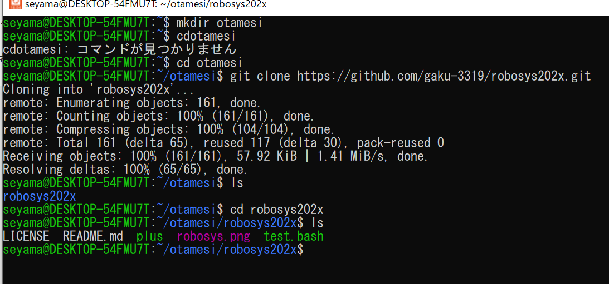
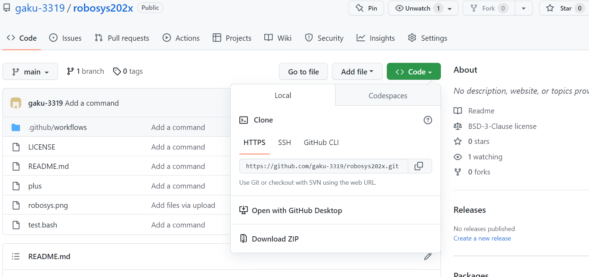
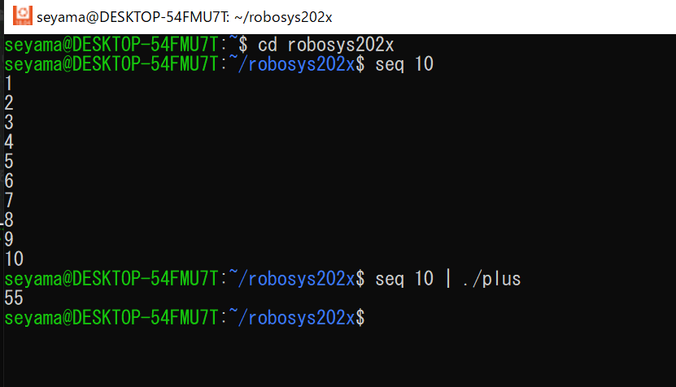

# robosys202x

# < plusコマンド>


標準入力から読み込んだ数字を足すコマンド

## ダウンロード方法
```
git cloneコマンドを使用してダウンロードする
```

　　　　　↑実行例 
* 1.ターミナルにて、自分がコピーしたいディレクトリに移動する
* 2.git clone リポジトリURL ディレクトリ名という形でコマンドを実行する

　　 ↑リポジトリURLはgithubのCodeからHTTPよりコピーする
* 3.コピーが始まり、ダウンロード完了`
## 簡単な使い方
 
        ↑実行しているターミナルの様子
* 1.ファイルの入っているディレクトリに移動
* 2.整数を出力する
* 3.出力した整数をplusが受け取る
* 4.実行。数字の足された値がターミナルに出力される。
## 必要なソフトウェア

* Python
* テスト済みバージョン: 3.7～3.10

## テスト環境

* Ubuntu18.04

## ライセンス
* このソフトウェアパッケージは，3条項BSDライセンスの下，再頒布および使用が許可されます
  © 2022 Gakuto Seyama
